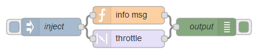
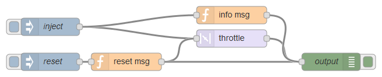

node-red-contrib-throttle
=========================

[](http://github.com/eisbehr-/node-red-throttle)
[](http://www.npmjs.org/package/node-red-contrib-throttle)
[](https://david-dm.org/eisbehr-/node-red-throttle)

A <a href="http://nodered.org" target="_new">Node-RED</a> node to throttle down outgoing messages.

---

## Table of Contents
* [Install](#install)
* [Usage](#usage)
  * [By Time](#by-time)
  * [By Count](#by-count)
  * [By Reset](#by-reset)
* [Example Flows](#example-flows)
  * [Example by Time](#example-by-time)
  * [Example by Count](#example-by-count)
  * [Example by Block Size](#example-by-block-size)
  * [Example by Reset](#example-by-reset)
* [Bugs / Feature request](#bugs--feature-request)
* [License](#license)
* [Donation](#donation)

---

## Install

Run the following command in your Node-RED user directory - typically `~/.node-red`:

```
npm install node-red-contrib-throttle
```


## Usage

A simple node to throttle down passed through message amount.
Just insert the throttle node in between two others, and the passed through message amount can be limited by different parameters.
Every other messages will be dropped.


### By Time

Limits the passed through messages by a given amount of time.  
**For example:** setting the node to `10 seconds` means, that only one message in ten seconds will be forwarded.


### By Count

Limits the passed through messages by a given count.  
**For example:** setting the node to a count of `5` means, that only every fifth message will be forwarded.


### By Reset

Will only pass through a single message, when a message with `msg.reset` was received before.


## Example Flows

Simple examples showing how to use the throttle and it's output.


### Example by Time



```JSON
[{"id":"81be4802.e74478","type":"function","z":"8a25646f.9d541","name":"info msg","func":"msg.payload = \"injected\";\nreturn msg;","outputs":1,"noerr":0,"x":800,"y":60,"wires":[["789ee5ac.32e214"]]},{"id":"789ee5ac.32e214","type":"debug","z":"8a25646f.9d541","name":"output","active":true,"console":"false","complete":"payload","x":950,"y":80,"wires":[]},{"id":"99fbadf5.9b42e8","type":"throttle","z":"8a25646f.9d541","name":"","throttleType":"time","timeLimit":"3","timeLimitType":"seconds","countLimit":"3","blockSize":0,"locked":false,"x":800,"y":100,"wires":[["789ee5ac.32e214"]]},{"id":"681f30ee.8f3598","type":"inject","z":"8a25646f.9d541","name":"inject","topic":"","payload":"!!! PASSED THROUGH !!!","payloadType":"str","repeat":"","crontab":"","once":false,"x":650,"y":80,"wires":[["99fbadf5.9b42e8","81be4802.e74478"]]}]
```


### Example by Count


```JSON
[{"id":"a3d7f710.99f97","type":"debug","z":"8a25646f.9d541","name":"output","active":true,"console":"false","complete":"payload","x":950,"y":200,"wires":[]},{"id":"e2c6599a.0b5c98","type":"function","z":"8a25646f.9d541","name":"info msg","func":"msg.payload = \"injected\";\nreturn msg;","outputs":1,"noerr":0,"x":800,"y":180,"wires":[["a3d7f710.99f97"]]},{"id":"8a2c177f.24e0c8","type":"throttle","z":"8a25646f.9d541","name":"","throttleType":"count","timeLimit":"10","timeLimitType":"seconds","countLimit":"3","blockSize":0,"locked":false,"x":800,"y":220,"wires":[["a3d7f710.99f97"]]},{"id":"836ebd21.ad25","type":"inject","z":"8a25646f.9d541","name":"inject","topic":"","payload":"!!! PASSED THROUGH !!!","payloadType":"str","repeat":"","crontab":"","once":false,"x":650,"y":200,"wires":[["8a2c177f.24e0c8","e2c6599a.0b5c98"]]}]
```


### Example by Block Size



```JSON
[{"id":"32aac7a2.1c4d2","type":"function","z":"8a25646f.9d541","name":"info msg","func":"msg.payload = \"injected\";\nreturn msg;","outputs":1,"noerr":0,"x":800,"y":300,"wires":[["cc05fc6b.4e2598"]]},{"id":"ad1cf860.9c085","type":"throttle","z":"8a25646f.9d541","name":"","throttleType":"block","timeLimit":"10","timeLimitType":"seconds","countLimit":"3","blockSize":"3","locked":false,"x":800,"y":340,"wires":[["cc05fc6b.4e2598"]]},{"id":"8925c66d.9381d8","type":"inject","z":"8a25646f.9d541","name":"inject","topic":"","payload":"!!! PASSED THROUGH !!!","payloadType":"str","repeat":"","crontab":"","once":false,"x":490,"y":320,"wires":[["ad1cf860.9c085","32aac7a2.1c4d2"]]},{"id":"8a84f4e3.491f18","type":"inject","z":"8a25646f.9d541","name":"reset","topic":"","payload":"reset","payloadType":"str","repeat":"","crontab":"","once":false,"x":490,"y":380,"wires":[["c83fa727.0f0b3"]]},{"id":"c83fa727.0f0b3","type":"function","z":"8a25646f.9d541","name":"reset msg","func":"msg.reset = true;\nreturn msg;","outputs":1,"noerr":0,"x":620,"y":380,"wires":[["ad1cf860.9c085","cc05fc6b.4e2598"]]},{"id":"cc05fc6b.4e2598","type":"debug","z":"8a25646f.9d541","name":"output","active":true,"console":"false","complete":"payload","x":970,"y":380,"wires":[]}]
```


### Example by Reset


```JSON
[{"id":"4e11480f.2fad28","type":"function","z":"8a25646f.9d541","name":"info msg","func":"msg.payload = \"injected\";\nreturn msg;","outputs":1,"noerr":0,"x":800,"y":460,"wires":[["c1d324bd.d2feb8"]]},{"id":"50915215.704714","type":"throttle","z":"8a25646f.9d541","name":"","throttleType":"reset","timeLimit":"10","timeLimitType":"seconds","countLimit":"3","blockSize":0,"locked":false,"x":800,"y":500,"wires":[["c1d324bd.d2feb8"]]},{"id":"4ba961e0.c018c8","type":"inject","z":"8a25646f.9d541","name":"inject","topic":"","payload":"!!! PASSED THROUGH !!!","payloadType":"str","repeat":"","crontab":"","once":false,"x":490,"y":480,"wires":[["50915215.704714","4e11480f.2fad28"]]},{"id":"f786e09d.1cdfa","type":"inject","z":"8a25646f.9d541","name":"reset","topic":"","payload":"reset","payloadType":"str","repeat":"","crontab":"","once":false,"x":490,"y":540,"wires":[["bbf770bd.df0768"]]},{"id":"bbf770bd.df0768","type":"function","z":"8a25646f.9d541","name":"reset msg","func":"msg.reset = true;\nreturn msg;","outputs":1,"noerr":0,"x":620,"y":540,"wires":[["50915215.704714","c1d324bd.d2feb8"]]},{"id":"c1d324bd.d2feb8","type":"debug","z":"8a25646f.9d541","name":"output","active":true,"console":"false","complete":"payload","x":970,"y":540,"wires":[]}]
```


## Bugs / Feature request
Please [report](http://github.com/eisbehr-/node-red-throttle/issues) bugs and feel free to [ask](http://github.com/eisbehr-/node-red-throttle/issues) for new features directly on GitHub.


## License
This project is licensed under [Apache 2.0](http://www.apache.org/licenses/LICENSE-2.0) license.


## Donation
_You like to support me?_  
_You appreciate my work?_  
_You use it in commercial projects?_  
  
Feel free to make a little [donation](https://www.paypal.com/cgi-bin/webscr?cmd=_s-xclick&hosted_button_id=FFL6VQJCUZMXC)! :wink: